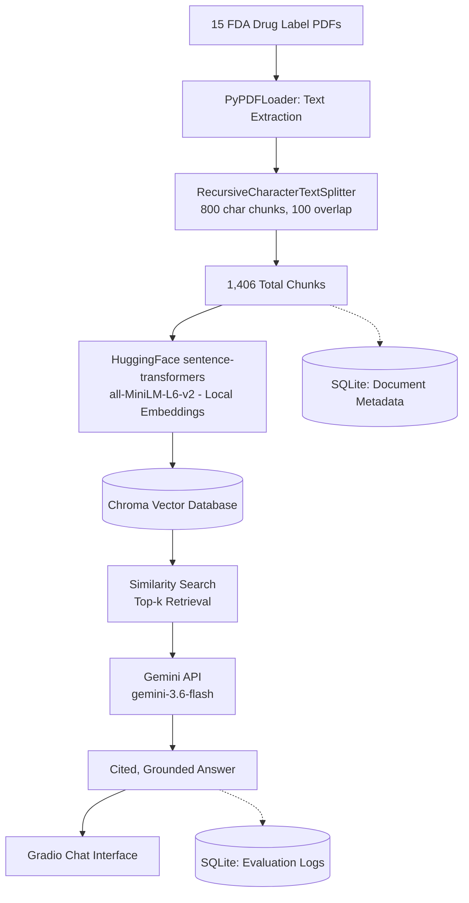
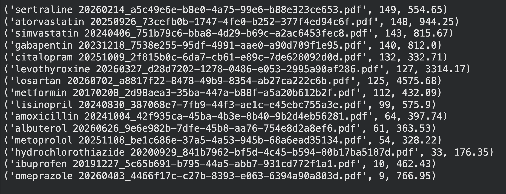
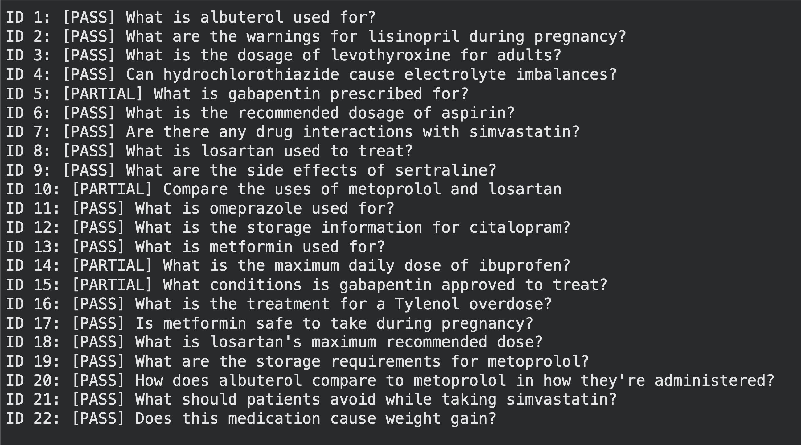
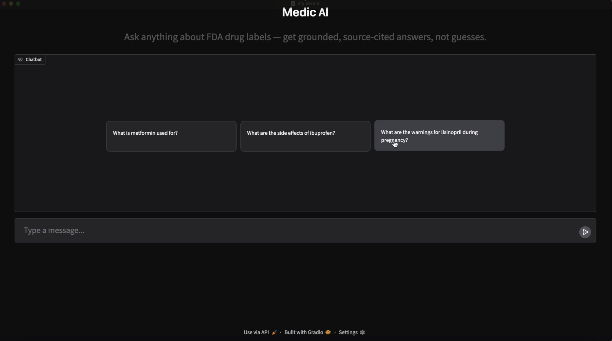

# Medic AI — Healthcare Document RAG Assistant

## Overview
Medic AI is a Retrieval-Augmented Generation (RAG) assistant that answers questions about FDA drug labels using only the content of a curated document set, rather than general model knowledge. Built for researchers, students, or anyone who needs to quickly verify specific drug information (dosages, warnings, interactions, storage) without manually reading through lengthy prescribing documents. The system retrieves relevant passages from source PDFs, generates a grounded answer using Google's Gemini API and cites exactly which document the answer came from with explicit refusal to answer when information isn't present in the dataset.

## Problem Statement
FDA drug labels contain dense, safety critical information but are long, inconsistently structured and time-consuming to search manually. A naive LLM-only approach risks a serious failure mode in healthcare contexts: confidently generating plausible but incorrect information when it doesn't actually know the answer. This project addresses both problems with a retrieval-first system that only answers from verified source documents and explicitly states when information isn't available, rather than guessing.

## Architecture


**Documents covered:** albuterol, amoxicillin, atorvastatin, citalopram, gabapentin, hydrochlorothiazide, ibuprofen, levothyroxine, lisinopril, losartan, metformin, metoprolol, omeprazole, sertraline, simvastatin

## Tech Stack
Python, LangChain, RAG, Google Gemini API, HuggingFace sentence-transformers, Chroma (vector DB), SQLite (SQL), Gradio, Google Colab

## User Stories & Acceptance Criteria

**User Story 1**
As a researcher or student, I want to ask natural-language questions about a specific drug's warnings or side effects, so that I can quickly verify safety information without reading an entire label document.

*Acceptance Criteria:*
- Given a question about a drug included in the document set, when submitted, then the system returns an answer grounded in that drug's label, with the source filename cited.
- Given a question about a drug NOT included in the document set, when submitted, then the system explicitly states the information isn't available, rather than generating an unsupported answer.

**User Story 2**
As a user asking an ambiguous question (not naming a specific drug), I want the system to handle the ambiguity intelligently, so that I still get a useful answer instead of a dead end.

*Acceptance Criteria:*
- Given a question that doesn't specify which drug is meant, when multiple drugs in the document set are potentially relevant, then the system addresses the most relevant candidates individually rather than defaulting to one arbitrary guess.

**User Story 3**
As a developer evaluating this system, I want a structured, repeatable way to test its accuracy and failure modes, so that its real-world reliability is documented rather than assumed.

*Acceptance Criteria:*
- Given a set of test questions covering factual lookups, ambiguous phrasing, cross-document comparisons, and out-of-scope drugs, when run through the system, then question, expected behavior, actual answer, and pass/fail verdict are logged to a queryable database.

## SQL Usage

Two SQLite tables support this project:

```sql
CREATE TABLE documents (
    id INTEGER PRIMARY KEY AUTOINCREMENT,
    filename TEXT NOT NULL,
    filepath TEXT NOT NULL,
    chunk_count INTEGER,
    file_size_kb REAL,
    date_processed TEXT
)

CREATE TABLE evaluations (
    id INTEGER PRIMARY KEY AUTOINCREMENT,
    question TEXT NOT NULL,
    expected_behavior TEXT,
    actual_answer TEXT,
    passed TEXT,
    date_tested TEXT
)
```

Example query — aggregating evaluation results:
```sql
SELECT passed, COUNT(*) FROM evaluations GROUP BY passed
```



## Evaluation & Testing

22 test questions were run against the system, covering factual lookups across all 15 documents, hallucination-resistance checks (asking about drugs not in the dataset), a grounding check (avoiding reliance on general medical knowledge), cross-document comparisons, and an ambiguous/unnamed-drug question.

**Results: 18 PASS, 4 PARTIAL, 0 FAIL, 0 hallucinations**



Notable finding: the system correctly refused to answer questions about drugs outside its document set (e.g., aspirin, Tylenol) rather than generating a plausible but false answer — the most important behavior for a healthcare-context tool.

## Demo




[Watch the demo video]([your-linkedin-or-youtube-link-here](https://www.linkedin.com/posts/fatema-alam-074496249_ai-machinelearning-rag-activity-7506455012366180353-ltDS?utm_source=share&utm_medium=member_desktop&rcm=ACoAAD15QdgBxfVk9JBvFSBHeNauhxxXK_SoxO8))

## Limitations
- Gabapentin's main indication section was not reliably retrieved at k=3, reproduced across two separate test questions — a real, identified retrieval gap rather than a one-off fluke
- Cross-document "which of these" queries are limited by retrieval depth (k=3); a comprehensive comparison would need higher k or a per-document query strategy
- Retrieval occasionally surfaces cross-drug content when topics are semantically similar (e.g., generic side-effect language matching across unrelated drugs)
- Free-tier Gemini API quota (20 generations/day) constrained how much evaluation and live testing could be done in a single session
- Local HuggingFace embeddings were used instead of Gemini's embedding API due to free-tier rate limits during development — a documented, deliberate tradeoff, not a hidden shortcut
- Chroma was used as the vector store for prototype-scale simplicity; a production system with larger document volumes or multiple concurrent users would need a managed vector database

## Future Work
- Build a standalone chat interface independent of Gradio/Streamlit for full UI/UX control
- Explore Microsoft Copilot Studio for enterprise-style agent deployment
- Learn Power Automate basics for workflow integration
- Investigate how this prototype could connect into enterprise data and workflow systems
- Expand the evaluation set and increase retrieval depth (k) for cross-document queries
- Migrate from SQLite to PostgreSQL if scaling beyond prototype stage
